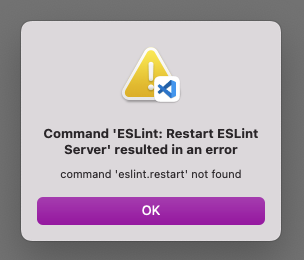

# vscode-eslint-autofix

minimal setup for https://github.com/microsoft/vscode-eslint/issues/1657

## Issue 1: Unable to restart eslint server
How to reproduce: 
1. Install recommended extension (`dbaeumer.vscode-eslint`) with the newest version
2. Run `npm i`
3. Run `"ESLint: Restart ESLint server"` from command palette

The following error occurs as a popup

Further, no issues are highlighted in the `index.js` files as it would be expected.
Running `npx eslint .` shows the issues that should be highlighted.

## Issue 2: Autofix fails
However, the main issue is that eslint is unable to perform an `auto-fix` action.

1. open file `index.js`
2. Run `"ESLint: Fix all auto-fixable Problems"` from command palette

Again, the following popup comes up:

There is no output for any of these issues.

## Solving both problems
1. Install recommended extension (`dbaeumer.vscode-eslint`) ***with version 2.4.4.***
2. Restart/Reload VS Code
3. Open `index.js`

You'll see that all the issues are highlighted now. 
Additionally, running `"ESLint: Restart ESLint server"` and `"ESLint: Fix all auto-fixable Problems"` both results in the desired outputs. So version 2.4.4 seems to work

## Environment
**Device**
- System: Apple M1 Pro 16 GB
- OS: macOS Sonoma 14.5

**VS Code**
- Version: 1.87.0 (Universal)
- Commit: 019f4d1419fbc8219a181fab7892ebccf7ee29a2
- Date: 2024-02-27T23:42:56.944Z
- Electron: 27.3.2
- ElectronBuildId: 26836302
- Chromium: 118.0.5993.159
- Node.js: 18.17.1
- V8: 11.8.172.18-electron.0
- OS: Darwin arm64 23.5.0
